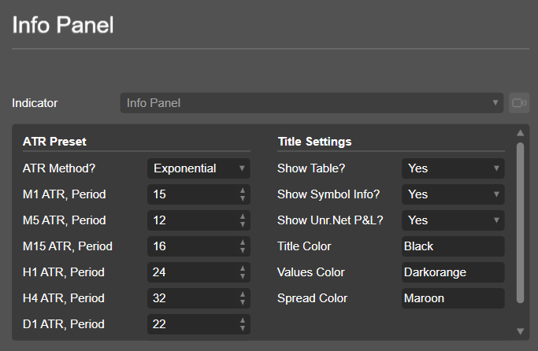

## Have ADR, ATR, Spread, Unrealized Net P/L, and symbol-info in your Ctrader-Charts

### Installation:

Just copy the indicator(Info Panel.algo) from Info Panel Directory to your PC and double-click on it. It will install automatically on your Ctrader-Platform. You can also download it directly from the Ctrader network:      
<a href="https://ctrader.com/algos/indicators/show/2907" title="Info Panel">Ctrader Developer Network</a>

### Settings:

As shown in the picture, The colors are customizable. You can choose the ATR-Calculation method and define the different periods for common timeframes. When you switch your chart's timeframe, the tool detects the change and calculates the ATR depending on your timeframe and settings.

